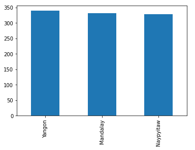
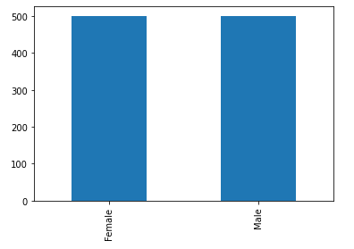
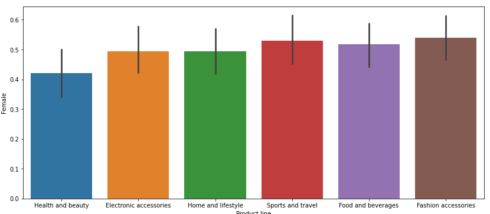

# Supermarket-Data-Analysis

### Project Overview
This program, written in Python, examines data on grocery store sales to learn more about consumer behavior and product performance. Pandas is used to load the dataset, while the Matplotlib and Seaborn libraries are used for various data exploration and visualization approaches.

### Dataset 
The dataset used for analysis is located at /kaggle/input/supermarket-sales/supermarket_sales - Sheet1.csv. It contains information about supermarket sales transactions, including columns like Invoice ID, Branch, City, Customer type, Gender, Product line, Unit price, Quantity, Tax 5%, Total, Date, Time, Payment, cogs, gross margin percentage, gross income, and Rating.

### Data Exploration
The script checks the first five entries of the dataset to acquire a general overview. The dataset's form is then confirmed, and 1000 rows and 17 columns are established. Additionally, it ensures that the dataset doesn't contain any null values by looking for any missing ones.

### Exploratory Data Analysis
The exploratory data analysis (EDA) section provides valuable insights into the dataset:
* The bar plot shows the distribution of customers across different cities, indicating the city with the most customers. 
* The bar plot illustrates the gender distribution of customers and demonstrates that there are nearly equal numbers of male and female clients. 
* The script creates dummy variables for the 'Gender' column and uses bar plots to compare the purchase preferences of male and female customers across different product lines.
