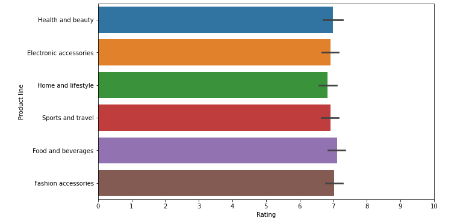

# Supermarket-Data-Analysis

### Project Overview
This program, written in Python, examines data on grocery store sales to learn more about consumer behavior and product performance. Pandas is used to load the dataset, while the Matplotlib and Seaborn libraries are used for various data exploration and visualization approaches.

### Dataset 
The dataset used for analysis is located at /kaggle/input/supermarket-sales/supermarket_sales - Sheet1.csv. It contains information about supermarket sales transactions, including columns like Invoice ID, Branch, City, Customer type, Gender, Product line, Unit price, Quantity, Tax 5%, Total, Date, Time, Payment, cogs, gross margin percentage, gross income, and Rating.

### Data Exploration
The script checks the first five entries of the dataset to acquire a general overview. The dataset's form is then confirmed, and 1000 rows and 17 columns are established. Additionally, it ensures that the dataset doesn't contain any null values by looking for any missing ones.

### Exploratory Data Analysis
The exploratory data analysis (EDA) section provides valuable insights into the dataset:
* The bar plot shows the distribution of customers across different cities, indicating the city with the most customers.
 
* The bar plot illustrates the gender distribution of customers and demonstrates that there are nearly equal numbers of male and female clients. 
 
* The script creates dummy variables for the 'Gender' column and uses bar plots to compare the purchase preferences of male and female customers across different product lines.
 
 
* A pie chart displays the distribution of different payment methods used by customers.
 
* Bar plots depict the gross income for each product line, indicating the product lines that generate the most profits.
  
* A bar plot shows the average rating for each product line, providing insights into the popularity of products among customers.
  
* The analysis includes bar plots for the total sales and quantity sold for each product line, helping to identify popular products and their sales patterns.
  
  

### Result of Analysis
* The total number of customers is 1000, with 501 females and 499 males.
* The minimum rating is 4, and the maximum rating is 10, with an average rating of 6.97.
* The product line 'Food & Beverages' receives the highest average rating, indicating its popularity among customers.
* The product line 'Home & Lifestyle' generates the highest average gross income, while 'Fashion Accessories' generates the lowest.
* The majority of customers purchase 10 quantities of products in a single transaction.
* The product line 'Home & Lifestyle' has the highest average total bill, while 'Fashion Accessories' has the lowest.
* The most common payment method used by customers is 'Ewallet'.
* The city with the highest number of customers is 'Yangon'.
Overall, this analysis provides valuable insights into customer preferences, product performance, and payment behavior. These insights can be used to improve marketing strategies, optimize product offerings, and enhance customer satisfaction at the supermarket.
